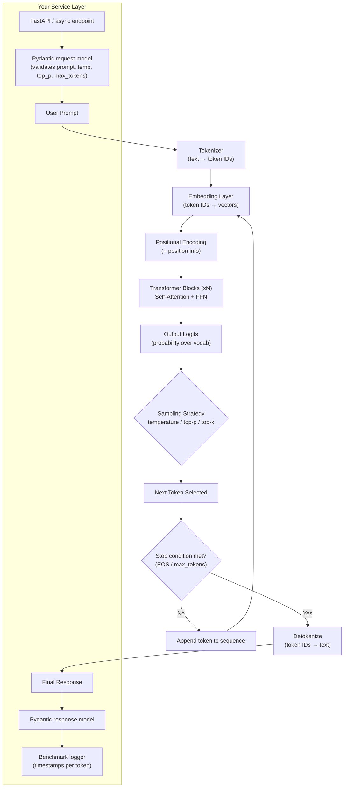

# LLM Inference Pipeline — Architecture

## Diagram

**How to read this:** the top flow (A → L) is the actual model-internal inference loop — this runs once per generated token (it's autoregressive: steps C→H repeat for every new token, re-processing the growing sequence). The bottom subgraph is your service wrapper — where async, Pydantic validation, and benchmarking instrumentation live.

---

## Stage-by-stage explanation

### 1. Tokenization
- Input text is split into subword tokens using the model's tokenizer (BPE / SentencePiece / etc.).
- Each token maps to an integer ID from a fixed vocabulary.
- **In your code:** wherever you call `tokenizer.encode(prompt)` — log `len(tokens)` here (this is your *prompt token count*).

### 2. Embeddings
- Each token ID is looked up in an embedding matrix → a dense vector (e.g. 4096-dim).
- A positional encoding (absolute, RoPE, ALiBi, etc.) is added/combined so the model knows token order.

### 3. Attention (Transformer blocks)
- Each block computes **self-attention**: every token's representation is updated by attending to (weighting) all other tokens in the context so far.
- Query/Key/Value projections determine "how much should token X pay attention to token Y."
- Followed by a feed-forward network (FFN), residual connections, and layer norm.
- This repeats for N layers (depth of the model).
- **Why context window matters:** attention cost grows with sequence length (roughly O(n²) for full attention), which is why longer context = slower + more memory.

### 4. Logits → Sampling (source of nondeterminism)
- The final layer outputs a probability distribution over the entire vocabulary for "what's the next token."
- **Temperature** reshapes this distribution: low temp (→0) sharpens it toward the single most likely token (more deterministic); high temp flattens it (more random/creative).
- **Top-p (nucleus sampling)** truncates the distribution to the smallest set of tokens whose cumulative probability ≥ p, then samples from that set.
- **Top-k** similarly truncates to the k most likely tokens.
- Even with the same prompt, sampling means two runs can diverge.

### 5. Autoregressive decoding loop
- One token is generated per forward pass.
- That token is appended to the sequence, and the *entire* process (embed → attention → logits → sample) runs again to produce the *next* token.
- First-token latency (whole prompt processed + token 1) is usually much higher than per-token latency afterward, because subsequent steps reuse cached key/value states (the "KV cache").
- Generation stops at an EOS token or `max_tokens` limit.

### 6. Detokenization
- Generated token IDs are converted back to text and streamed/returned to the user.

---

## Notes / assumptions
- Assumed a standard decoder-only Transformer (GPT-style) with full or KV-cached self-attention.
- Swap the diagram's attention block if your model uses a different variant (e.g. grouped-query attention, sliding-window attention) — worth calling out explicitly in your write-up if relevant.
