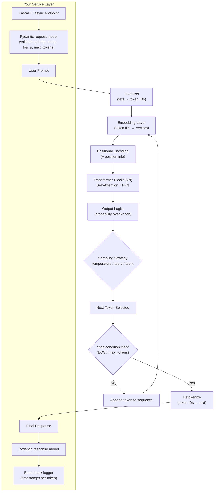

# Week 2 — Transformers, Attention & Decoding
## Implementation Guide: LLM Inference Pipeline Explanation + Token Generation Benchmark

> Assignment: *Explain the inference pipeline and benchmark token generation.*
> This guide assumes you're reusing your existing base (async Python + Pydantic + tokenization + LLM call) and adding an explanation layer + a benchmarking layer on top.

---

## 1. What "done" looks like

Two deliverables, both grounded in your running code — not just theory:

1. **A written/visual explanation** of the inference pipeline (tokenize → embed → attention → logits → sample → decode → repeat), tied to where each step happens in your code.
2. **A benchmark**: real numbers for tokens/sec, first-token latency, per-token latency, and how `temperature` / `top_p` change output determinism.

---

## 2. Architecture Diagram



**How to read this:** the top flow (A → L) is the actual model-internal inference loop — this runs once per generated token (it's autoregressive: steps C→H repeat for every new token, re-processing the growing sequence). The bottom subgraph is your service wrapper — where async, Pydantic validation, and benchmarking instrumentation live.

---

## 3. Pipeline Explanation (map this to your code)

### 3.1 Tokenization
- Input text is split into subword tokens using the model's tokenizer (BPE / SentencePiece / etc.).
- Each token maps to an integer ID from a fixed vocabulary.
- **In your code:** wherever you call `tokenizer.encode(prompt)` — log `len(tokens)` here for later benchmarking (this is your *prompt token count*).

### 3.2 Embeddings
- Each token ID is looked up in an embedding matrix → a dense vector (e.g. 4096-dim).
- A positional encoding (absolute, RoPE, ALiBi, etc.) is added/combined so the model knows token order.

### 3.3 Attention (Transformer blocks)
- Each block computes **self-attention**: every token's representation is updated by attending to (weighting) all other tokens in the context so far.
- Query/Key/Value projections determine "how much should token X pay attention to token Y."
- Followed by a feed-forward network (FFN), residual connections, and layer norm.
- This repeats for N layers (depth of the model).
- **Why context window matters:** attention cost grows with sequence length (roughly O(n²) for full attention), which is why longer context = slower + more memory.

### 3.4 Logits → Sampling (this is where nondeterminism comes from)
- The final layer outputs a probability distribution over the entire vocabulary for "what's the next token."
- **Temperature** reshapes this distribution: low temp (→0) sharpens it toward the single most likely token (more deterministic); high temp flattens it (more random/creative).
- **Top-p (nucleus sampling)** truncates the distribution to the smallest set of tokens whose cumulative probability ≥ p, then samples from that set.
- **Top-k** similarly truncates to the k most likely tokens.
- Even with the same prompt, sampling means two runs can diverge — this is the "why outputs are nondeterministic" answer, and you should demonstrate it (see §4.3).

### 3.5 Autoregressive decoding loop
- One token is generated per forward pass.
- That token is appended to the sequence, and the *entire* process (embed → attention → logits → sample) runs again to produce the *next* token.
- This is why **first-token latency** (time to process the whole prompt + produce token 1) is usually much higher than **per-token latency** afterward (each subsequent step reuses cached key/value states — "KV cache" — so it's cheaper).
- Generation stops at an EOS token or `max_tokens` limit.

### 3.6 Detokenization
- Generated token IDs are converted back to text and streamed/returned to the user.

---

## 4. Benchmarking Layer

### 4.1 What to measure
| Metric | Definition | Why it matters |
|---|---|---|
| Time to first token (TTFT) | timestamp(first token) − timestamp(request sent) | dominated by prompt length + model load |
| Per-token latency | avg time between subsequent tokens | dominated by decode step cost |
| Tokens/sec (throughput) | total tokens generated ÷ total generation time | overall speed metric |
| Prompt tokens vs completion tokens | from tokenizer counts | cost/context tracking |

### 4.2 Minimal benchmark script structure

```python
import time
import asyncio
from pydantic import BaseModel

class BenchmarkResult(BaseModel):
    prompt_tokens: int
    completion_tokens: int
    ttft_seconds: float
    total_seconds: float
    tokens_per_second: float

async def benchmark_single_run(client, prompt: str, **gen_kwargs) -> BenchmarkResult:
    start = time.perf_counter()
    first_token_time = None
    token_count = 0

    async for chunk in client.stream_generate(prompt, **gen_kwargs):
        if first_token_time is None:
            first_token_time = time.perf_counter()
        token_count += 1

    end = time.perf_counter()
    total = end - start
    ttft = first_token_time - start if first_token_time else total

    return BenchmarkResult(
        prompt_tokens=len(client.tokenizer.encode(prompt)),
        completion_tokens=token_count,
        ttft_seconds=round(ttft, 4),
        total_seconds=round(total, 4),
        tokens_per_second=round(token_count / total, 2) if total > 0 else 0,
    )

async def run_benchmark_suite(client, prompts: list[str], n_repeats: int = 3):
    results = []
    for prompt in prompts:
        for _ in range(n_repeats):
            r = await benchmark_single_run(client, prompt, max_tokens=200)
            results.append(r)
    return results
```

Adapt `client.stream_generate` to whatever async call your base project already uses (local model or API).

### 4.3 Demonstrating nondeterminism (temperature / top-p sweep)

Run the *same* prompt multiple times at different settings and log the outputs verbatim:

```python
settings_to_test = [
    {"temperature": 0.0, "top_p": 1.0},   # near-deterministic
    {"temperature": 0.7, "top_p": 0.9},   # typical default
    {"temperature": 1.2, "top_p": 1.0},   # high randomness
]

for settings in settings_to_test:
    for run in range(3):
        output = await client.generate(prompt, **settings)
        print(f"temp={settings['temperature']} run={run}: {output[:80]}...")
```

Expected observation to write up: `temperature=0.0` runs should be identical or near-identical across repeats; higher temperature runs diverge more each time.

### 4.4 Reporting results
Produce a small table/plot: x-axis = prompt length or settings, y-axis = tokens/sec and TTFT. A simple matplotlib bar chart or even a markdown table of your 3 repeats per setting is enough — the point is to show real measured numbers, not estimates.

---

## 5. Deliverable checklist

- [ ] Architecture diagram (above, or your own version) included in submission
- [ ] Written explanation of each pipeline stage, referencing your actual code (file/function names)
- [ ] Benchmark script run against your existing project, producing a results table
- [ ] Temperature/top-p sweep showing nondeterminism with real output samples
- [ ] Short paragraph: TTFT vs per-token latency, and why they differ (KV cache)
- [ ] Short paragraph: context window growth → attention cost tradeoff

---

## 6. Notes / assumptions made in this guide
- Assumed your base project already has: an async client wrapping an LLM (local or API), a tokenizer accessible for token counting, and Pydantic models for request/response validation.
- If your base doesn't stream tokens (only returns full completions), TTFT can't be measured directly — note that as a limitation in your write-up, or add streaming support if the assignment specifically needs it.
- Swap the Mermaid diagram's internals if your model uses a different attention variant (e.g. grouped-query attention, sliding window) — mention that explicitly if relevant, it's a good detail to include.
