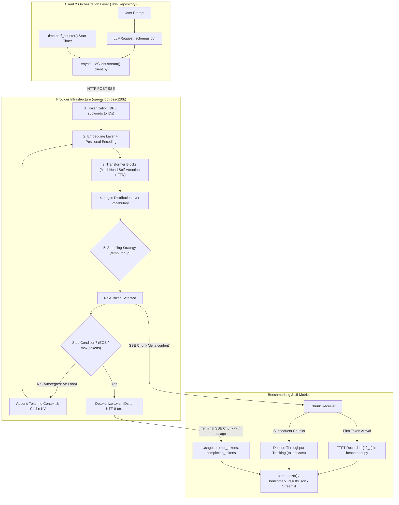

# LLM Inference Pipeline & Codebase Mapping

This document provides a concise architectural explanation of the end-to-end LLM inference pipeline, mapping theoretical Transformer stages directly to concrete modules, classes, and timing instrumentation in this codebase.

---

## 1. End-to-End Architecture Diagram

---

## 2. Pipeline Stages Mapped to Code

### 2.1 Tokenization
- **Concept**: Prompts are converted into discrete integer IDs from a fixed vocabulary via subword algorithms (e.g. Byte-Pair Encoding).
- **Code Mapping**: This client communicates across an API boundary and does not run local tokenizer weights. The provider performs tokenization and emits token counts. In [`llm_client/schemas.py`](./llm_client/schemas.py), the `Usage` model defines `prompt_tokens`, `completion_tokens`, and `total_tokens`. The client captures these counts via the `on_usage` callback inside [`llm_client/client.py`](./llm_client/client.py#L150-L165) when the provider attaches `stream_options: {"include_usage": true}`.

### 2.2 Embeddings & Positional Encoding
- **Concept**: Token IDs are looked up in a weight matrix to yield dense vectors (e.g., 4096-dimensional). Rotary Positional Embeddings (RoPE) inject sequence order information.
- **Code Mapping**: Executed entirely inside the provider's GPU cluster. The client defines model target selection via `LLMRequest.model` in [`llm_client/schemas.py`](./llm_client/schemas.py) (defaulting to `openai/gpt-oss-120b` via `LLM_DEFAULT_MODEL` in `.env`).

### 2.3 Attention & Transformer Layers
- **Concept**: Multi-head self-attention computes query-key-value matrix products ($Q K^T / \sqrt{d_k}$), dynamically routing information between prompt tokens. Context length incurs roughly $O(N^2)$ prefill compute scaling.
- **Code Mapping**: Handled provider-side. In our benchmark harness [`llm_client/benchmark.py`](./llm_client/benchmark.py) and CLI runner [`scripts/run_benchmark.py`](./scripts/run_benchmark.py), we test short, medium, and long prompts to observe how prompt length increases Time to First Token (TTFT) during the attention prefill phase.

### 2.4 Logits & Sampling (Nondeterminism Engine)
- **Concept**: The final projection layer yields unnormalized log probabilities (logits) across the vocabulary.
  - `temperature` sharpens ($T \to 0$) or flattens ($T > 1$) the softmax probability distribution.
  - `top_p` (nucleus sampling) truncates candidates to the smallest probability subset summing to $p$.
- **Code Mapping**: Configured in [`llm_client/schemas.py`](./llm_client/schemas.py) via `LLMRequest.temperature` (`ge=0.0, le=2.0`) and `LLMRequest.top_p` (`ge=0.0, le=1.0`). In [`llm_client/benchmark.py`](./llm_client/benchmark.py), `summarize()` groups repeated executions by `(prompt, temperature, top_p)` and verifies output variation across repeats.

### 2.5 Autoregressive Decoding Loop & KV Cache
- **Concept**: Generation occurs sequentially: one forward pass produces one token, which is appended to the sequence. The Key-Value (KV) cache preserves past attention states to avoid quadratic recalculation for each generated token.
- **Code Mapping**: Directly materialized by the asynchronous streaming loop in [`llm_client/client.py`](./llm_client/client.py#L179-L194) (`async for line in resp.aiter_lines()`) and FastAPI's SSE stream in [`app.py`](./app.py#L170-L195). Each SSE delta corresponds to one step of the autoregressive decode loop.

### 2.6 TTFT vs. Decode-Phase Latency
- **Concept**:
  - **TTFT (Time to First Token)**: Measures request transmission, provider queueing, and full-prompt prefill compute (processing all input tokens concurrently).
  - **Decode Throughput (Tokens/sec)**: Measures single-token generation iterations dominated by memory-bandwidth lookups from High Bandwidth Memory (HBM) into the KV cache.
- **Code Mapping**:
  - In [`llm_client/benchmark.py`](./llm_client/benchmark.py#L60-L115), monotonic timing with `time.perf_counter()` captures `first_token_time - start_time` as `ttft_s`, and overall generation throughput as `tokens_per_second`.
  - In [`static/index.html`](./static/index.html), client-side JS functions `updatePipelineFirstToken` and `completePipelineSuccess` visualize this latency split in the browser.
  - In [`pages/2_Week2_Benchmark.py`](./pages/2_Week2_Benchmark.py), this metric is displayed live with interactive repeat inspections.
